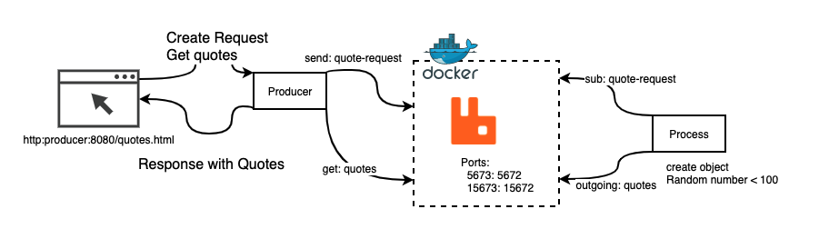

# Quarkus RabbitMQ Example

Please read [Official Guide]() this repository is based by official guide.


## Configuration



## Start up

### first start RabbitMQ
```shell
docker-compose up -d
```

### Producer start
```
mvn -f rabbitmq-quickstart-producer quarkus:dev
```

### Process start

```
mvn -f rabbitmq-quickstart-processor quarkus:dev
```

### Access to Quotes page Producer http://localhost:8080/quotes.html

## Code Tree
```
├── README.md
├── docker-compose.yml
├── rabbitmq-quickstart-processor
│   ├── README.md
│   ├── mvnw
│   ├── mvnw.cmd
│   ├── pom.xml
│   ├── src
│   └── target
└── rabbitmq-quickstart-producer
    ├── README.md
    ├── mvnw
    ├── mvnw.cmd
    ├── pom.xml
    ├── src
    └── target
```

## Future
- [ ] Quarkus Native Mode..